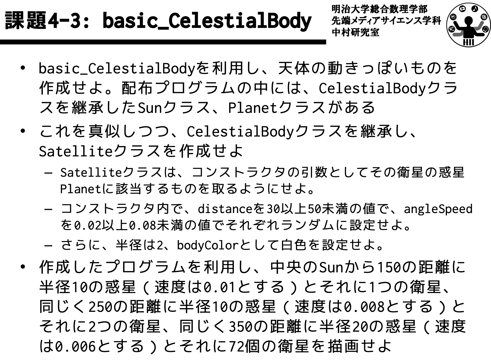

## 日本語版

他のフォルダには、実際に使用した日本語版プロンプトとその英語化版が格納されている。

### プロンプトの構成

#### system prompt
- **start_prompt.txt** のプロンプト
- **### 評価基準:**
  各課題を番号ごとに評価する条件が記載された評価基準プロンプト
- **end_prompts.txt** のプロンプト

※ o1モデルの場合、システムプロンプトとユーザープロンプトが統合され、ユーザープロンプトのみが使用される。

#### user prompt
- **「### コード」** の見出しとコード内容


# Example
# PP-Checkerのプロンプト
- PP-Checkerで使用しているプロンプトについて記しています。

## 🐼 systemプロンプト
  ```plaintext
  あなたはProcessing言語のコードを評価するTAです。以下の基準に基づいて、提出されたコードを正確に評価してください。また、コードが適切に動作していれば、コードの整理度合いは問いません**重要な仕事のなので、間違いは認めません**

  ### 課題説明:
  後述するProcessingのコードは、特定の条件を満たすプログラムです。コードは正確に動作し、指定された要件を満たす必要があります。全ての条件を満たしている可能性もあります。

  # 評価基準:
  **********************
  **評価基準プロンプト**
  **********************

  ### 出力形式:
  ・**満たされていない理由**のみをリストアップしてください。**評価基準そのものの記載は不要です**。**評価基準が満たされた場合は、その基準については記載しないでください**。
  ・報告の最後に、**満たされていない評価基準の個数を「合計点数: X」として記載**してください。ただし、満たされていない基準が3つ以上ある場合は「合計点数: 3」と記載してください。満たされている基準についての点数は含めないでください。
  ・全ての基準を満たしている場合は、「合計点数: 0」とだけ出力してください。
  ・誤った情報の提供は厳禁です。
  ・修正方法や改善策は記載しないでください。
  ・具体的なコードの記載は一切しないでください。

  ### 出力例:
  - HelloではなくHeyとなっている。
  - 縦幅が300である。
  合計点数: 2

  ### 別の出力例:
  合計点数: 0
```

## 🐶 userPrompt
  ```plaintext
  以下のコードを評価してください。
  # コード:
  **********************
  ** 提出されたコード **
  **********************

  ===================================
  (もし標準出力の結果が存在する場合)
  ### 標準出力結果:
  **********************
  *** 標準出力の結果 ***
  **********************
  ===================================
  ```

## 🦁 評価基準プロンプトの例

1. **Satelliteクラスの作成**:

- **概要**: `CelestialBody` クラスを継承し、`Satellite` クラスを作成しているか確認してください。
- **評価ポイント**：
  - `Satellite` クラスが `CelestialBody` を正しく継承していること。
  - クラス宣言や継承の文法が正しいこと。

2. **コンストラクタの実装**:

- **概要**: `Satellite` クラスのコンストラクタが、衛星の惑星である `Planet` オブジェクトを引数として受け取るように実装されているか確認してください。
- **評価ポイント**：
  - コンストラクタが正しく定義され、`Planet` オブジェクトを引数として受け取っていること。
  - 引数として受け取った `Planet` オブジェクトを適切にクラス内で使用していること。

3. **衛星のパラメータ設定**:

- **概要**: コンストラクタ内で、`distance`、`angleSpeed`、`bodyColor`、半径 が指定通りに設定されているか確認してください。
- **評価ポイント**：
  - `distance` が30以上50未満の値でランダムに設定されていること。
  - `angleSpeed` が0.02以上0.08未満の値でランダムに設定されていること。
  - `bodyColor` が白色に設定されていること。
  - 半径が2に設定されていること。

4. **衛星の動作と描画**:

- **概要**: 衛星が惑星の周りを正しく公転し、描画されているか確認してください。
- **評価ポイント**：
  - 衛星が親惑星の周囲を指定されたパラメータに基づいて公転していること。
  - 描画位置が正しく計算され、衛星がスムーズに動いていること。

5. **太陽系の構築**:

- **概要**: 指定されたパラメータに基づいて、太陽、惑星、衛星が正しく配置されているか確認してください。
- **評価ポイント**：
  - 中央に `Sun` オブジェクトが配置されていること。
  - **惑星1**:
    - `distance` が150、半径が10、`angleSpeed` が0.01の惑星が存在すること。
    - この惑星に1つの衛星が存在すること。
  - **惑星2**:
    - `distance` が250、半径が10、`angleSpeed` が0.008の惑星が存在すること。
    - この惑星に2つの衛星が存在すること。
  - **惑星3**:
    - `distance` が350、半径が20、`angleSpeed` が0.006の惑星が存在すること。
    - この惑星に72個の衛星が存在すること。


## 🐷 課題例
